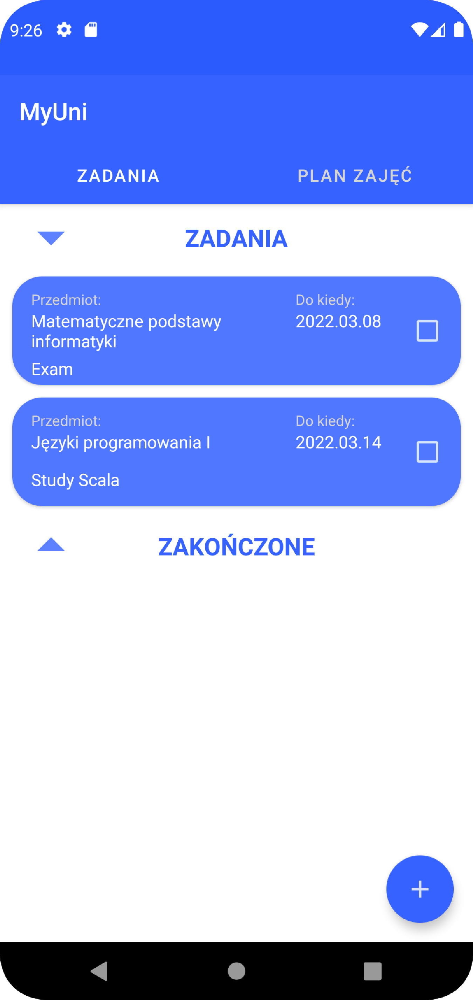
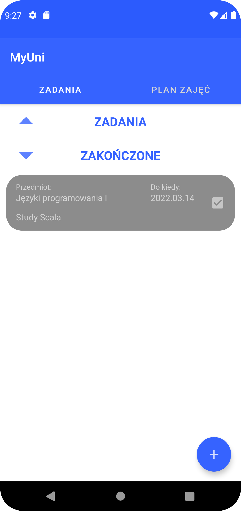
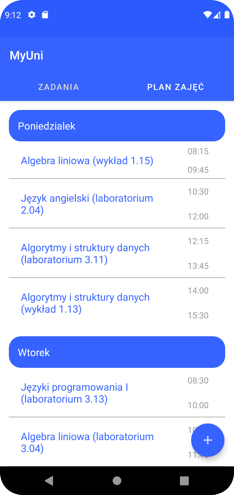
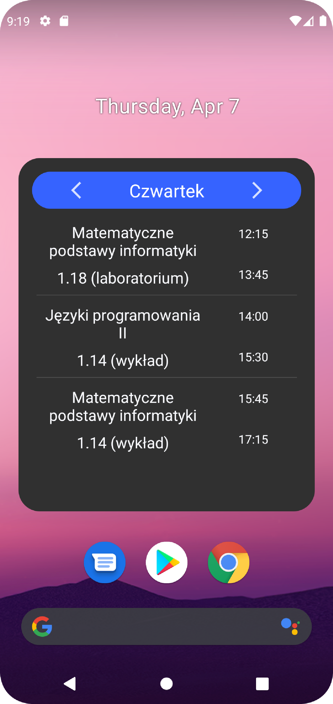
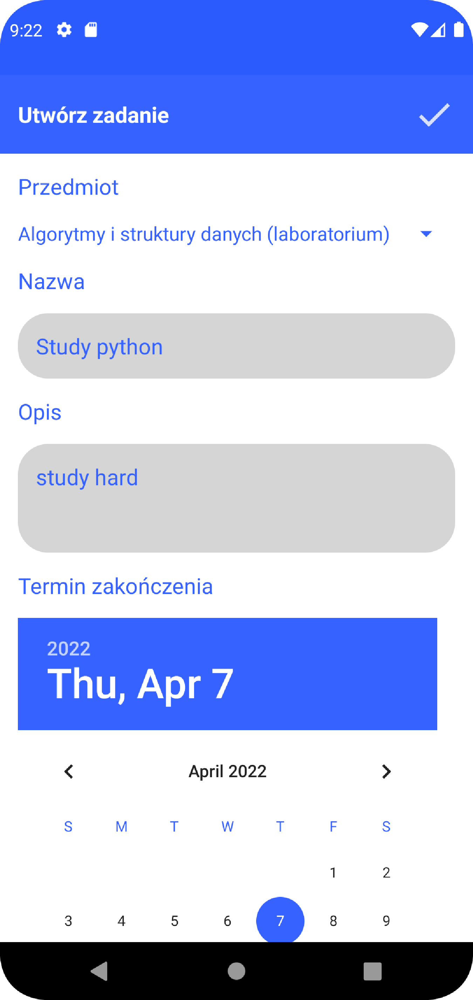
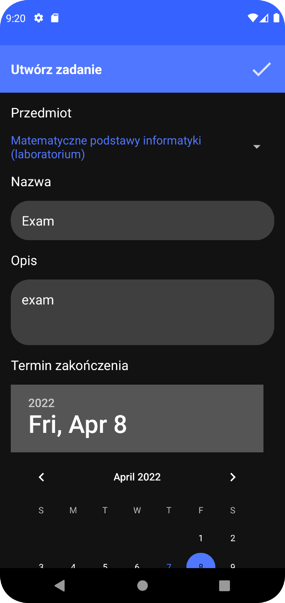

# MyUni

---

## About this project

### A collaborative project, set up by two students which aims to provide mobile app with functions like timetable and tasks-to-do

### server-side developer:  [Adam Grochowski](https://github.com/Znany)

### android mobile developer: [Kamil Radzimowski](https://github.com/DzikiOwoc15)

### Switch to branch in which you are interested in

---
## Tech used

### Languages: Kotlin, PHP

### Android Tech: RxKotlin, Kotlin coroutines, MVVM, Room local database

---

## Features

### :clipboard: Tasks stored on our servers 

### :chart_with_upwards_trend: Save tasks that have been completed

### :bar_chart: Timetable

### :iphone: Timetable widget on your's phone main screen

### :white_check_mark: Add new tasks 

### :moon: Dark and :sun_with_face: light mode

---

## Info

### For android branch switch to => mobile

### For server files branch switch to => server

